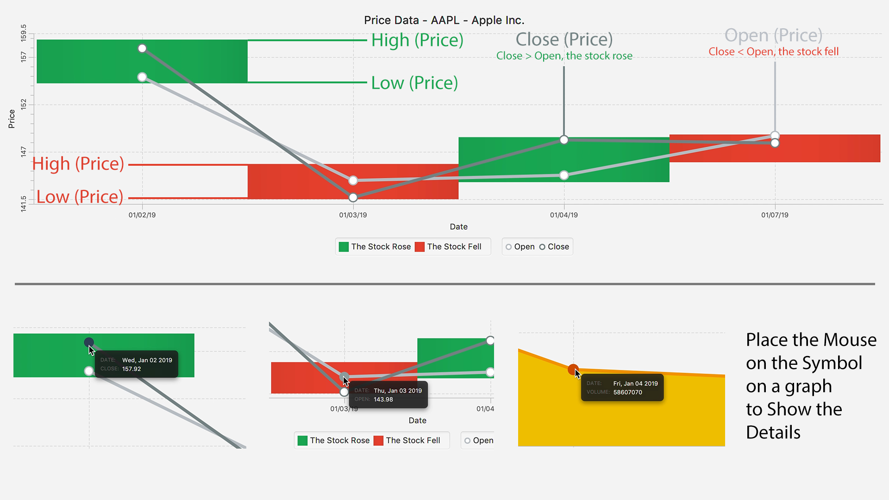

# A Viewer for Stock Market Data
This is a Java project that retrieves stock price data for a ticker from Wall Street Journal and visualise data in the UI.

### **Screenshot of the demo**


The project is implemented with Core Libraries of [Java 1.8](https://www.oracle.com/java/technologies/javase/javase-jdk8-downloads.html), including [JavaFX](https://www.oracle.com/java/technologies/javase/javafx-overview.html). 
Please make sure the correct version of Java SDK to consume the product.

---

### **How to consume the project**

The main class of the project called [`MarketGUI.java`](MarketGUI.java).
To begin with, you need to compile the project using the following command in the terminal:
```shell script
javac MarketGUI.java
```
Then, use the following command to start the project:
```shell script
java MarketGUI
```

---

### **Introduction**

When the program starts, a dialog should be displayed as below:


This dialog is consist of input components for user to query specific market data for a ticker, including:
- A drop-down box for selecting a ticker symbol from a list.
- Two drop-down boxes for selecting the start and end dates respectively. 
- A submission button that allows user to submit input data to retrieve correspond stock market data.

There are some restrictions regarding user input before hitting the "Submit" button:
- All input fields should not be empty.
- The start date cannot be ahead of the end date.
- The device should connect to the internet.

Otherwise, a dialog will pop up to show error message, and the query process will not be able to proceed.

If the input fields are valid, and the internet is connected, the endpoint provided by WSJ will be hit. Then, data retrieved from the API should be displayed in a separate window. 
This window draws a graph showing the ticker data within the selected date range:
- The stock’s open, closing values for each day in the grey line chats.
- The stock's high and low value for each day in the rectangles.
- The horizontal coordinate shows dates, and the vertical coordinate shows stock prices.




The window is responsive. User is able to interact with the diagram:
- By clicking the top button "User Guide", a user guide dialog will pop up to inform user how to parse the data from the diagram.
- By hovering over the dots on the diagram, the user is able to check the date and price of the open and close prices.

---

### **Limitations**

- The user can only select specific tickers from the drop-down menu.
- Due to the limitation of the endpoint of WSJ, only 5 days data will be retrived.
